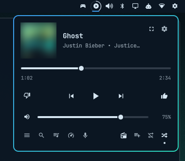

# YouTube Music Player for Omarchy



A YouTube Music mini player for the [Omarchy](https://omarchy.org) bar. Click
the play-circle on the bar for a small player: the cover, song and artist,
a progress bar you can drag, play / pause / skip, like / dislike, volume,
shuffle and repeat, plus tabs for your **queue**, **search**, **library**,
**speed dial** (YouTube Music's "Listen again") and **lyrics**.

> **Unofficial.** This isn't made by or affiliated with Google / YouTube. It
> reads the YouTube Music web page and uses the same internal requests the page
> itself makes, so a YouTube update can break parts of it at any time. The
> player checks for that whenever YouTube Music opens and tells you if
> something stopped working.

## What it can do

- **Now playing** — cover, title, artist · album (long text scrolls on hover),
  draggable progress bar, previous / play-pause / next, like / dislike, volume
  with mute, shuffle and repeat (a dot shows when they're on).
- **Queue** — starts at the song playing now, 20 at a time with album covers.
  Click to play, drag the ⋮⋮ grip to reorder, swipe left (or right-click) to
  remove.
- **Search** — results update as you type, with YouTube Music's own filter
  chips (Songs, Albums, Artists, Videos, Community playlists, …). Hover a
  result for play now / play next / add to queue; clicking an artist opens
  their page with Shuffle / Radio and section chips, including **All songs**
  with Play all / Shuffle all.
- **Library** — your playlists, Liked Music and saved albums. Pin favourites to
  the top or hide ones you don't want to see (both kept on this computer only).
- **Speed dial** — YouTube Music's quick-access shelf, plus a **Recently
  played** list.
- **Lyrics** — what YouTube Music has for the current song.
- **Start radio** and **save to playlist** for the current song.
- **Song card** — a small card under the bar icon when you use the media keys,
  and (optionally) whenever the song changes.
- **Sleep timer**, a thin **progress ring** around the bar icon, and **"Up next"**
  in the bar icon's tooltip.
- **Audio focus** — when a YouTube video or another app starts playing,
  YouTube Music pauses (can be turned off).
- **Equalizer** (optional) — bass / mid / treble for the music, using
  PipeWire's built-in equalizer (no extra software).

## Requirements

- Omarchy with the Quickshell-based shell (bar widgets / plugins).
- YouTube Music open in a Chromium-family browser (Chromium, Chrome, Brave or
  Vivaldi) — for example as an Omarchy web app (`omarchy-webapp-install`).
- `python3` (the bridge helper and scripts), `hyprctl`, `pactl` / `pw-cli`
  (PipeWire; equalizer only).

## Install

```sh
omarchy plugin add https://github.com/Dqckey/omarchy-ytmusic-player.git --enable
```

Without the next step the player already shows the song and handles play /
pause / skip through your system's media controls. Everything else needs the
**bridge**:

```sh
~/.config/omarchy/plugins/dqckey.ytmusic-player/setup.sh          # or: setup.sh --eq
```

then, once:

1. In your browser open `chrome://extensions`, turn on **Developer mode**,
   click **Load unpacked** and choose
   `~/.config/omarchy/plugins/dqckey.ytmusic-player/bridge/extension`.
2. Reload your YouTube Music tab / window.

`setup.sh` registers a small helper (a Chrome "native messaging host") so the
extension can talk to the bar, prints the steps above, and suggests keyboard
shortcuts. `--eq` also installs the optional equalizer.

## Keyboard shortcuts (optional)

Add to `~/.config/hypr/bindings.lua` (the `hl.unbind` lines free keys Omarchy
uses by default):

```lua
hl.unbind("SUPER + SHIFT + M")      -- was: Spotify
o.bind("SUPER + SHIFT + M", "Music player", "omarchy-shell shell toggle dqckey.ytmusic-player")
o.bind("SUPER + CTRL + M", "Play / pause music", "omarchy-shell -q ytmusic-player-media toggle")
hl.unbind("SUPER + CTRL + RIGHT")   -- was: next window in a group
hl.unbind("SUPER + CTRL + LEFT")    -- was: previous window in a group
o.bind("SUPER + CTRL + RIGHT", "Next song", "omarchy-shell -q ytmusic-player-media next")
o.bind("SUPER + CTRL + LEFT", "Previous song", "omarchy-shell -q ytmusic-player-media previous")
o.bind("SUPER + CTRL + UP", "Music volume up", "omarchy-shell -q ytmusic-player-volume up", { repeating = true })
o.bind("SUPER + CTRL + DOWN", "Music volume down", "omarchy-shell -q ytmusic-player-volume down", { repeating = true })
```

To send your keyboard's media keys to YouTube Music (with the song card):

```lua
for _, key in ipairs({ "XF86AudioPlay", "XF86AudioPause", "XF86AudioNext", "XF86AudioPrev" }) do hl.unbind(key) end
o.bind("XF86AudioPlay", "Play / pause music", "omarchy-shell -q ytmusic-player-media toggle", { locked = true })
o.bind("XF86AudioPause", "Play / pause music", "omarchy-shell -q ytmusic-player-media toggle", { locked = true })
o.bind("XF86AudioNext", "Next song", "omarchy-shell -q ytmusic-player-media next", { locked = true })
o.bind("XF86AudioPrev", "Previous song", "omarchy-shell -q ytmusic-player-media previous", { locked = true })
```

## Settings

The gear in the player's top-right corner: pause music when other audio
starts, how long the song card stays and fades, equalizer, sleep timer,
song-change card, progress ring, and which
sections an artist page shows. Settings live in
`~/.config/ytmusic-player/settings.json`; pins and hidden items next to it.

## How it works

| Piece | What it does |
| --- | --- |
| `Widget.qml` | The bar widget and player (Quickshell / QML). |
| `bridge/extension/` | Chromium extension. `content.js` / `page.js` run only on `music.youtube.com`: they report the song, queue, like / shuffle / repeat state, and carry out the player's commands (clicking YouTube Music's own buttons or using its own internal requests). `other.js` runs on `youtube.com` only to notice a video starting (for audio focus) and reads nothing else. |
| `bridge/host.py` | The helper the browser starts for this extension only. It writes the page's state to `~/.local/state/ytmusic-player/` and forwards an allowlisted set of commands from the bar. It never runs anything it receives. |
| `bin/ytmusic-cmd` | Sends a command to the bridge (`ytmusic-cmd --help`). |
| `bin/ytmusic-key` | Fallback: sends YouTube Music's keyboard shortcuts to its window when the bridge isn't loaded. |
| `bin/music-eq` + `eq/` | The optional equalizer (a PipeWire filter-chain). |

The extension uses a fixed ID (its public key is in `manifest.json`), so the
helper only accepts that one extension.

## Uninstall

```sh
~/.config/omarchy/plugins/dqckey.ytmusic-player/setup.sh --uninstall
omarchy plugin remove dqckey.ytmusic-player
```

and remove the extension in `chrome://extensions`.

## License

MIT — see [LICENSE](LICENSE).
